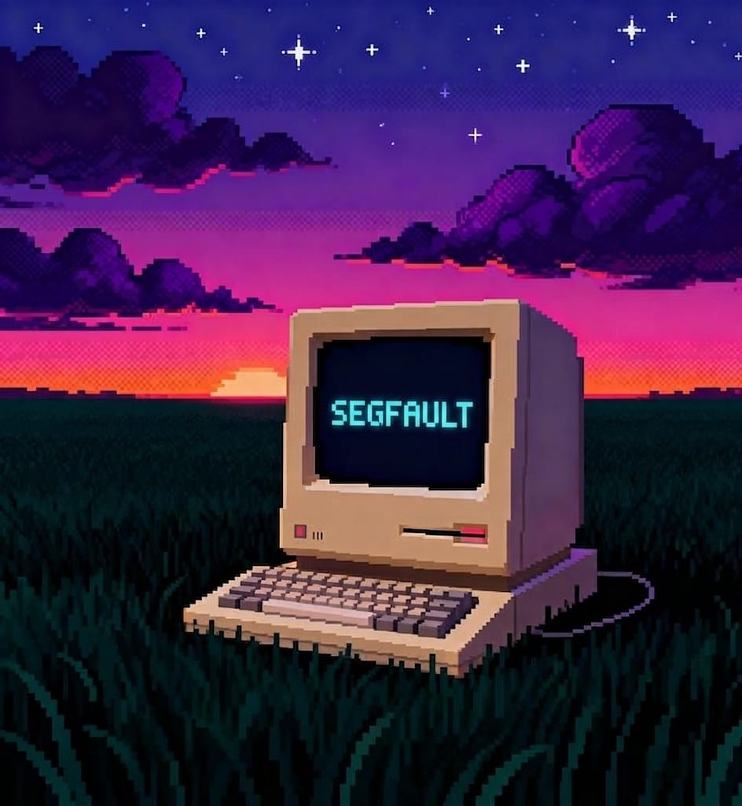

# SEGFAULT



A dev-themed top-down pixel beat-'em-up with an **adaptive offline AI**.

You pushed a hotfix to prod at 2am. Reality threw an exception. Now you can
*see* the bugs — and you have to debug your way out, one chapter at a time.

The headline feature: the chapter's mini-boss (the **Heuristic**) *learns how
you fight* and counters you — entirely offline. Spam ranged attacks and it
rushes you down; dodge constantly and it baits the dodge then punishes. If you
have a local [Ollama](https://ollama.com) model running it'll also use the LLM
as a slow strategist, but it works fully without one.

```
┌───────────────────────────────────────────────────────────┐
│  AI[OFFLINE-LEARN] :: rush                                 │
│  learned: ranged 0.5  dodgy 0.11  dist 550.2              │
│                          ◆  "found your pattern"          │
└───────────────────────────────────────────────────────────┘
```

Everything you see — every sprite, every sound — is **generated in code**.
No art files, no audio files, no downloads. It just runs.

---

## Run it

A virtualenv with the right pygame is already set up in `.venv`. Just:

```bash
python3 run.py
```

`run.py` auto-bootstraps into `.venv` (which has a working `pygame-ce`), so it
doesn't matter which Python you launch it with. To set it up from scratch on
another machine:

```bash
python3 -m venv .venv
.venv/bin/pip install -r requirements.txt
python3 run.py
```

> **Why a venv?** The system `pygame` on this machine (Python 3.14) ships
> without the `font` and `mixer` C-extensions, so text and audio are broken
> there. `pygame-ce` in the venv has them. The game also has a freetype-based
> font fallback so it degrades gracefully even on a broken install.

## Controls

| Action      | Keys                          |
|-------------|-------------------------------|
| Move        | `W` `A` `S` `D`               |
| Aim         | mouse                         |
| Melee       | left-click  / `J`             |
| Shoot       | right-click / `K`             |
| Dodge roll  | `Space` / `Shift`             |
| Patch server| hold `E` in the glowing zone  |
| Pause       | `Esc` / `P`                   |

## Chapter 1 — LOCALHOST

1. Three of your servers are **corrupted (red)**. Stand in a server's zone and
   hold `E` to **patch** it.
2. Null-pointer bugs swarm you while you work. Survive.
3. Patch all three and the **Heuristic** spawns — the learning enemy. Beat it
   to clear the chapter.

Chapters 2–5 (TCP Handshake, DNS Labyrinth, Training Data, Prompt Injection)
are scaffolded and unlock-gated, ready to build out next. The Anime and Stark
heroes unlock as you progress.

## The "offline AI that learns from you"

Two layers, in `segfault/ai/brain.py`:

- **`PlayerProfile`** — cheap, always-on pattern tracking. Counts ranged vs
  melee, how much/which way you dodge, how close you play, whether you bail at
  low HP. *This is the learning.* No model required.
- **`AdaptiveBrain`** — a slow strategist. Every ~1.6s it picks a counter from
  the profile (instant, offline). If Ollama is running it *also* asks the LLM
  for a strategy + taunt in a background thread that never blocks the game.
  Until/unless the LLM answers, the offline heuristic drives.

Want it LLM-powered? `ollama pull llama3.2` and have `ollama serve` running.
Want it provably offline? Run with `SEGFAULT_NO_LLM=1` and watch it still adapt.

## Project layout

```
run.py                  launcher (bootstraps the venv)
segfault/
  main.py               Game shell + state stack + main loop
  constants.py          all tunables
  sprites.py            procedural pixel-art (heroes, enemies, tiles)
  sound.py              procedural SFX (stdlib synth -> pygame.mixer)
  save.py               JSON save in ~/.segfault
  utils.py / ui.py      math, fonts, menu eye-candy
  ai/brain.py           PlayerProfile + AdaptiveBrain + Ollama strategist
  entities/             player, enemy, projectile
  world/                level (Chapter 1) + deadzone camera
  states/               menu, character_select, playing, lesson, pause,
                        game_over, victory
  data/                 characters + chapter/lesson definitions
```

## Notes / credits

- Built with [pygame-ce](https://pyga.me).
- Optional LLM via [Ollama](https://ollama.com) (`llama3.2`).
- Save data lives in `~/.segfault/save.json` (override with
  `SEGFAULT_SAVE_DIR`).
- Concept: *Segfault* — the junior dev who can see the bugs.
