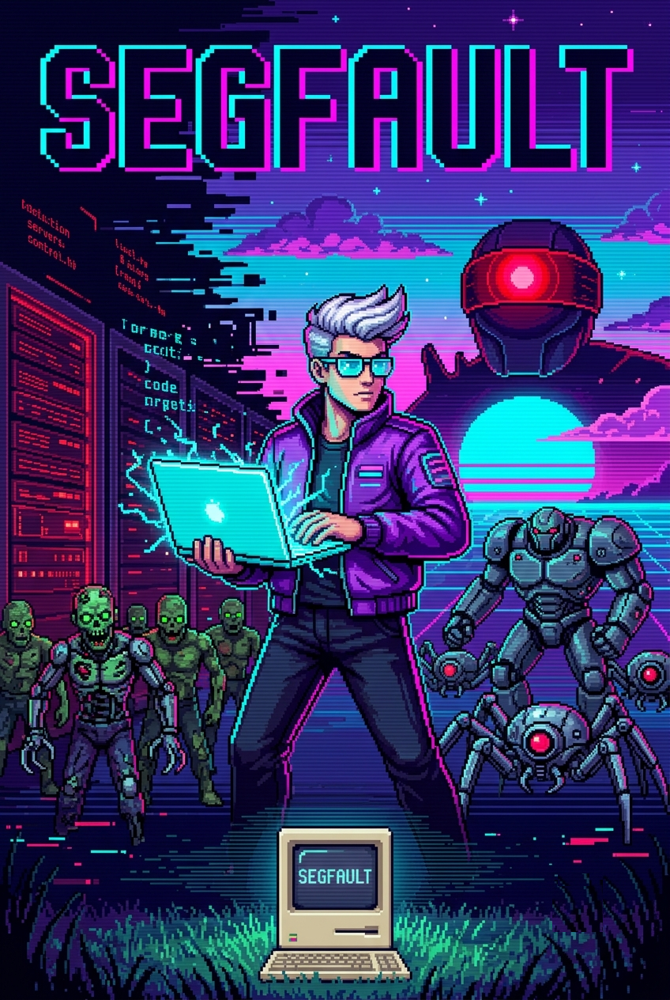

# SEGFAULT

<p align="center">
  
</p>

<p align="center">
  <b>A dev-themed top-down pixel beat-'em-up with an adaptive offline AI.</b><br>
  5 chapters · 8 heroes · cyborg enemies · a boss that learns how you fight.
</p>

You pushed a hotfix to prod at 2am. Reality threw an exception. Now you can
*see* the bugs — and you have to debug your way out, one chapter at a time.

The headline feature: each chapter's boss **learns how you fight** and counters
you — entirely offline. Spam ranged attacks and it rushes you down; dodge
constantly and it baits the dodge then punishes. It even **remembers your style
across sessions**. If you have a local [Ollama](https://ollama.com) model running
it'll also use the LLM as a slow strategist, but it works fully without one.

Everything you see — **every sprite, every sound, the music** — is *generated in
code*. No art files, no audio files, no downloads. It just runs.

---

## ▶ Run it

You need **Python 3.10+** and [pygame-ce](https://pyga.me). If you just cloned
this repo:

```bash
git clone https://github.com/shaikh-saud705/segfault-game
cd segfault-game
python3 -m venv .venv
.venv/bin/pip install -r requirements.txt
python3 run.py
```

`run.py` auto-bootstraps into the `.venv`, so once it exists you can launch with
any Python: `python3 run.py`.

> **Why a venv?** Some system pygame builds (e.g. on Python 3.14) ship without
> the `font`/`mixer` C-extensions, so text and audio break. `pygame-ce` in the
> venv has them. The game also has a freetype font fallback so it degrades
> gracefully even on a broken install.

**Optional — LLM boss:** install [Ollama](https://ollama.com), then
`ollama pull llama3.2`. The boss will use it as a strategist (you'll see
`AI[LLM] :: …` on the F3 overlay). Without it, the offline AI runs the show.

## 🎮 Controls

| Action          | Keys                            |
|-----------------|---------------------------------|
| Move            | `W` `A` `S` `D`                 |
| Aim             | mouse                           |
| Melee           | left-click / `J`                |
| Shoot           | right-click / `K`               |
| Dodge roll      | `Space` / `Shift`               |
| **Ability**     | `Q`                             |
| Patch objective | hold `E` in the glowing zone    |
| Armory (weapons)| `Tab` (on the character select) |
| Pause           | `Esc` / `P`                     |
| Debug overlay   | `F3` (FPS + live AI state)      |

## 🕹️ How to play

Each chapter is the same loop: **secure the objectives** (stand in a glowing
zone and hold `E`) while the chapter's enemies swarm you, then **beat the boss**.
Clear a chapter to unlock the next one — and a new hero.

### The 5 chapters (each teaches a real CS concept)

| # | Chapter | Teaches | Boss |
|---|---------|---------|------|
| 1 | **LOCALHOST** | what a segfault / null pointer is | The Heuristic |
| 2 | **TCP HANDSHAKE** | the 3-way handshake (SYN/SYN-ACK/ACK) | Man-in-the-Middle |
| 3 | **DNS LABYRINTH** | how DNS resolves names to IPs | Rogue Root Server |
| 4 | **TRAINING DATA** | how an LLM trains (tokens, loss, gradients) | The Untrained Model |
| 5 | **PROMPT INJECTION** | prompt injection & AI safety | The Architect (final) |

### The 8 heroes (unlock by clearing chapters)

Each has its own stats, **gun sound**, and a **special ability** on `Q`:

`THE DEV` (start) · `THE ANIME` · `THE SHOGUN` · `IRON MAN` · `ULTRON` ·
`BAYMAX` · `BUMBLEBEE` · `WALL-E`

Abilities include **Hotfix** (heal), **Nova** AoE bursts, projectile
**Barrages**, a **Guardian Shield** (brief invulnerability), and **Overdrive**
(speed + fire-rate boost).

### Weapons — the Armory

Press `Tab` on the character select to open the **Armory**. Unlock ranged
weapons by clearing chapters — Pistol, SMG, Shotgun (5 pellets), Plasma Rifle,
Pulse Cannon (3-round burst), Debugger Beam. Damage scales per hero; melee-only
heroes stay melee.

### Enemies

Cyborg zombies, mechanical spiders, armored cyborg mechs, HP-draining packet
sniffers, blinking DNS spoofers, and erratic hallucinations — plus a unique
named boss each chapter.

## 🧠 The "offline AI that learns from you"

Two layers, in `segfault/ai/brain.py`:

- **`PlayerProfile`** — cheap, always-on pattern tracking. Counts ranged vs
  melee, how much/which way you dodge, how close you play, whether you bail at
  low HP. *This is the learning.* No model required, and it's **saved to disk**
  so the boss remembers you next session.
- **`AdaptiveBrain`** — a slow strategist. Every ~1.6s it picks a counter from
  the profile (instant, offline). If Ollama is running it *also* asks the LLM
  for a strategy + taunt in a background thread that never blocks the game.
  Until/unless the LLM answers, the offline heuristic drives.

Want it provably offline? Run with `SEGFAULT_NO_LLM=1` and watch it still adapt.

## 🛠️ Tech

- **Pure Python + [pygame-ce](https://pyga.me)** — no other runtime deps.
- **Procedural everything**: pixel-art sprites, an in-code pixel bitmap font,
  SFX, and a looping synthwave music track — all generated at startup.
- Optional **local LLM** via [Ollama](https://ollama.com).
- Save data in `~/.segfault/save.json` (override with `SEGFAULT_SAVE_DIR`).

## 📁 Project layout

```
run.py                  launcher (bootstraps the venv)
requirements.txt        just pygame-ce
README.md / RESUME.md   docs + "where we left off" status
docs/                   poster + screenshots
tests/                  headless smoke test
segfault/
  main.py               Game shell + state stack + main loop
  constants.py          all tunables
  pixelfont.py          in-code pixel bitmap font
  sprites.py            procedural pixel-art (heroes, enemies, tiles)
  sound.py              procedural SFX + music (stdlib synth -> mixer)
  save.py               JSON save in ~/.segfault
  utils.py / ui.py      math, fonts, menu eye-candy
  ai/brain.py           PlayerProfile + AdaptiveBrain + Ollama strategist
  entities/             player, enemy, projectile
  world/                level + deadzone camera (with screen shake)
  states/               menu, character_select, weapon_select, playing,
                        lesson, pause, game_over, victory, options
  data/                 characters, chapters/lessons, weapons
```

## ⚠️ Notes

This is a **non-commercial personal fan project**. Several heroes (Iron Man,
Ultron, Baymax, Bumblebee, Wall-E) are *original pixel-art tributes* to
characters owned by their respective rights holders — they're here for fun and
learning, not for sale. The poster was AI-generated. Built for the love of
games and a good debugging metaphor. 🐛
